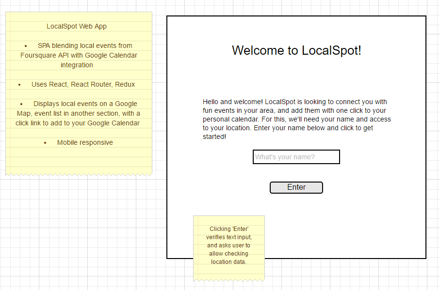

# LocalSpot - React SPA
Introducing LocalSpot, finding great local events, integrating with Google Maps, and
giving you the ability to add to your personal calendar!

## Technologies
* Uses React, React Router, Redux, babel, webpack
* Data from Foursquare API
* Integrates with Google Maps API to provide location Data
* Integrates with Google Calendar API to add event data to your personal Calendar

### Prototype Mockup

