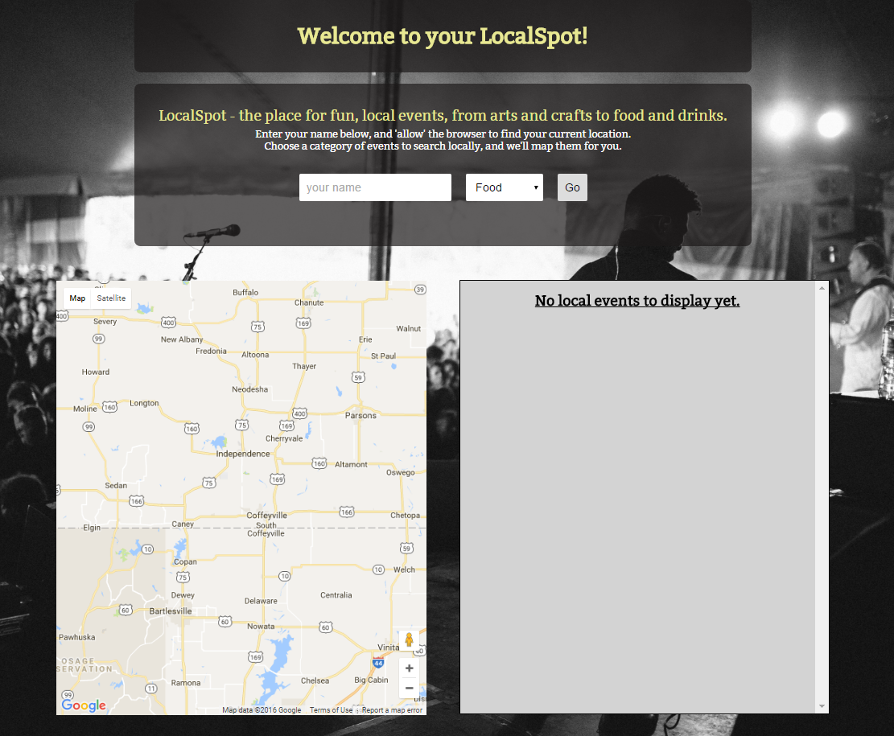
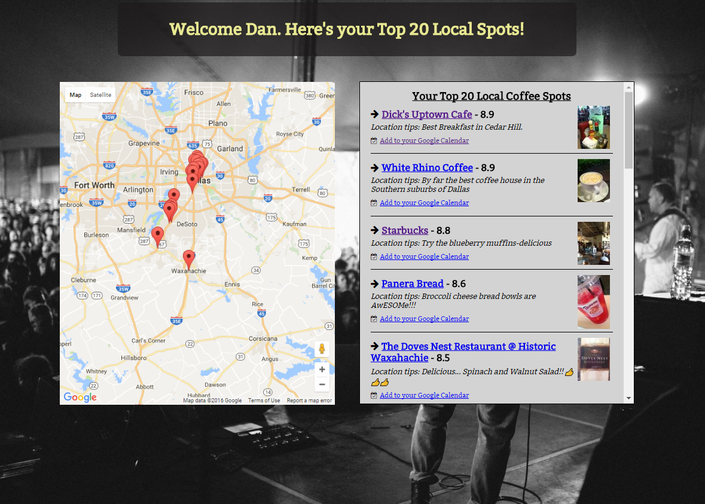
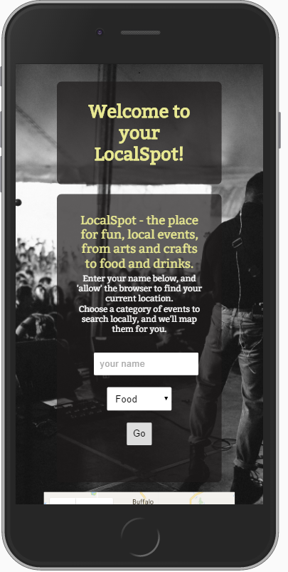
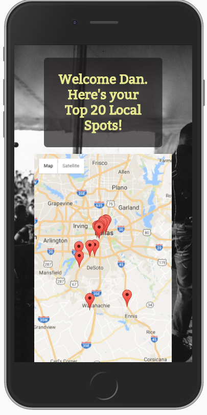
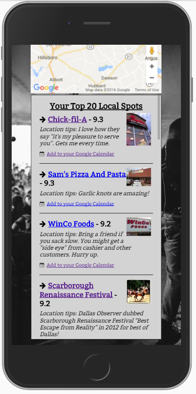

# LocalSpot - React SPA
Welcome to LocalSpot, finding great local events, integrating with Google Maps, and
giving you the ability to add to your Google Calendar!

Check out LocalSpot, accept the geolocation request, and choose a category of events (shopping, restaurants, coffee shops, trending and outdoor activities) to search for in your local area.

The app plots the locations nearby using Google Maps, and provides detailed information via the Foursqare API.  Mobile friendly, responsive.

## Technologies
* Uses React, React Router, Redux, babel, webpack, ES5/ES6, HTML5/CSS3,
* Data from Foursquare API
* Integrates with Google Maps API to provide location Data, plot events to local map
* Integrates with Google Calendar API to add event data to your personal Calendar

## Future improvements
* Improve geolocation performance and error handling, allow manual input for zip code/location
* Add additional information to markers
* Link to Google Maps for directions to chosen LocalSpot from user's current lat/lng
* Improved React performance, add ability to use brower's history/back to redo search

### Production App Screenshots

